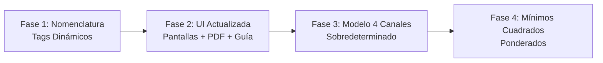

# Plan de Implementación Progresivo: Mejoras del Modelo Matemático

Implementación incremental de las mejoras descritas en las secciones 6.7 y 6.8 del documento [Modelo Matemático de Balanceo.md](file:///c:/Users/angel/balanceo_app/Modelo%20Matem%C3%A1tico%20de%20Balanceo.md). Cada fase se ejecuta, verifica y aprueba antes de avanzar a la siguiente.

---

## Fases Propuestas



---

## Fase 1 — Modelo de Datos: Tags Dinámicos de Canales (Sección 6.8)

> [!IMPORTANT]
> Esta es la fase fundacional. Renombramos internamente los sensores de "X/Y" a un modelo flexible con tags editables por el usuario, **sin romper la funcionalidad actual de 2 sensores**.

### Principio de Diseño
Los campos `sensorXAngulo` y `sensorYAngulo` en `RotorConfig` se reemplazan por una lista de objetos `CanalMedicion`. Para el modo actual de 2 sensores, la lista tiene exactamente 2 elementos. Los datos serializados antiguos se migran de forma transparente en `fromJson`.

### Cambios Propuestos

#### [NEW] [canal_medicion.dart](file:///c:/Users/angel/balanceo_app/lib/models/canal_medicion.dart)
Nuevo modelo de datos para representar un canal de medición:
```dart
class CanalMedicion {
  String tag;           // Ej: "1H", "2V", "DE-H", editable por el usuario
  double angulo;        // Ángulo físico del sensor (0°, 90°, etc.)
  int idSoporte;        // 1 o 2 (mapeo al rodamiento físico)
  String direccion;     // "H", "V", "X" o "Y"
}
```

#### [MODIFY] [rotor_config.dart](file:///c:/Users/angel/balanceo_app/lib/models/rotor_config.dart)
- Reemplazar `sensorXAngulo` y `sensorYAngulo` por `List<CanalMedicion> canales`.
- Agregar getters de compatibilidad (`sensorXAngulo`, `sensorYAngulo`) que deleguen a `canales[0].angulo` y `canales[1].angulo` para no romper el código consumidor de inmediato.
- Actualizar `toJson` / `fromJson` con migración retrocompatible: si el JSON contiene los campos antiguos `sensorXAngulo`/`sensorYAngulo`, se construyen los objetos `CanalMedicion` equivalentes automáticamente.
- Actualizar `copyWith`.

#### [MODIFY] [configuracion_screen.dart](file:///c:/Users/angel/balanceo_app/lib/screens/configuracion_screen.dart)
- Reemplazar los dos `TextFormField` de "Sensor X (°)" y "Sensor Y (°)" por campos dinámicos que muestren el **tag** y el **ángulo** de cada canal.
- El usuario ve: `Tag: [1H] Ángulo: [0°]` y `Tag: [2H] Ángulo: [0°]` (valores por defecto para el modo de 2 soportes horizontal).
- Los valores por defecto cambian de `0°/90°` → `0°/0°` (ambos horizontales, lo estándar en campo).
- Las variables locales `_sensorX` y `_sensorY` se reemplazan por una `List<CanalMedicion>` editable.

---

## Fase 2 — Actualización de Nomenclatura en Pantallas, PDF y Guía

> [!NOTE]
> Esta fase es puramente cosmética/textual. No toca la lógica matemática.

### Cambios Propuestos

#### [MODIFY] [medicion_inicial_screen.dart](file:///c:/Users/angel/balanceo_app/lib/screens/medicion_inicial_screen.dart)
- Las etiquetas `'Sensor 1 (X)'` y `'Sensor 2 (Y)'` pasan a mostrar dinámicamente el tag del canal: `config.canales[0].tag` y `config.canales[1].tag`.

#### [MODIFY] [prueba_coeficientes_screen.dart](file:///c:/Users/angel/balanceo_app/lib/screens/prueba_coeficientes_screen.dart)
- Misma actualización de etiquetas en todos los campos de entrada y el selector de sensor de cálculo.

#### [MODIFY] [resultados_screen.dart](file:///c:/Users/angel/balanceo_app/lib/screens/resultados_screen.dart)
- Etiquetas de vectores en los gráficos polares y en el diálogo de nueva iteración.

#### [MODIFY] [pdf_export.dart](file:///c:/Users/angel/balanceo_app/lib/utils/pdf_export.dart)
- Reemplazar todas las cadenas estáticas `'Sensor X'`, `'Sensor Y'`, `'Sensor 1 (X)'`, `'Sensor 2 (Y)'` por los tags dinámicos del `config.canales`.

#### [MODIFY] [guia.md](file:///c:/Users/angel/balanceo_app/guia.md)
- Actualizar la sección de simbología y colores para reflejar la nueva nomenclatura basada en tags.

---

## Fase 3 — Extensión a 4 Canales (Sistema Sobredeterminado) *(Futura)*
- Permitir que `canales` tenga 2 o 4 elementos.
- Ampliar `BalanceoProvider` para almacenar vectores de 4 canales.
- Implementar la pseudoinversa de Moore-Penrose.

## Fase 4 — Mínimos Cuadrados Ponderados *(Futura)*
- Agregar la matriz de pesos configurable por el usuario.
- Implementar filtros de calidad automáticos.

---

## Open Questions

> [!IMPORTANT]
> **Tags por defecto:** ¿Estás de acuerdo con que los tags por defecto para nuevos activos sean `1H` y `2H` (ambos horizontales a 0°) en lugar de los actuales `Sensor X` a 0° y `Sensor Y` a 90°? Esto se alinea con la práctica estándar de campo para balanceo en 2 planos (un sensor horizontal por cada soporte).

---

## Plan de Verificación (Fases 1 y 2)

### Pruebas Automatizadas
- `flutter analyze` sin errores.

### Pruebas Manuales
1. Crear un nuevo activo → verificar que los tags por defecto sean `1H` y `2H` con ángulos `0°` y `0°`.
2. Editar los tags a valores personalizados (`DE-H`, `NDE-V`) → confirmar persistencia al recargar.
3. Cargar un activo **previamente guardado** (con formato antiguo `sensorXAngulo`/`sensorYAngulo`) → verificar que migra correctamente y no se pierden datos.
4. Recorrer todo el flujo de balanceo de 1 plano y 2 planos → confirmar que los resultados matemáticos son idénticos a los anteriores.
5. Generar un PDF → verificar que muestra los tags personalizados.

> [!CAUTION]
> **Retrocompatibilidad:** La migración de datos serializados existentes (`SharedPreferences`) es crítica. Los activos guardados antes de este cambio deben poder ser cargados sin pérdida de información.
